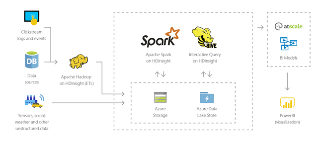
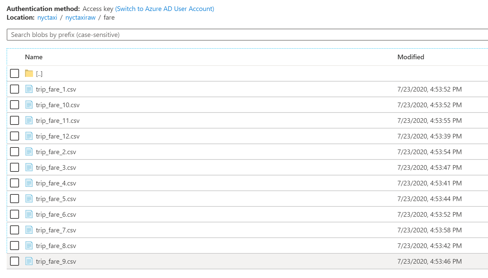
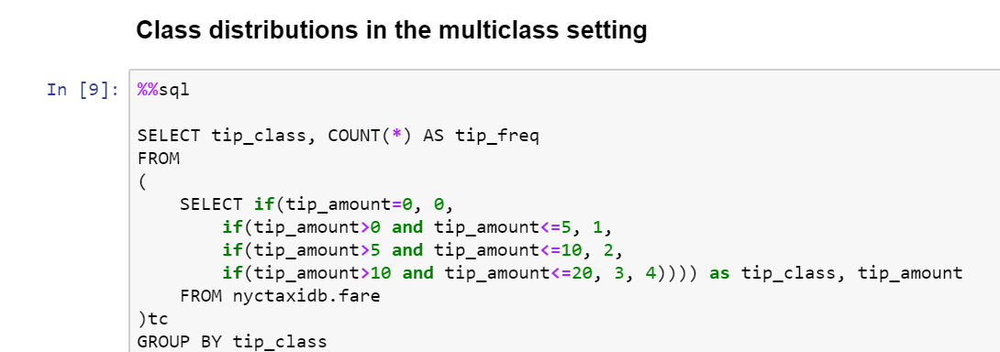
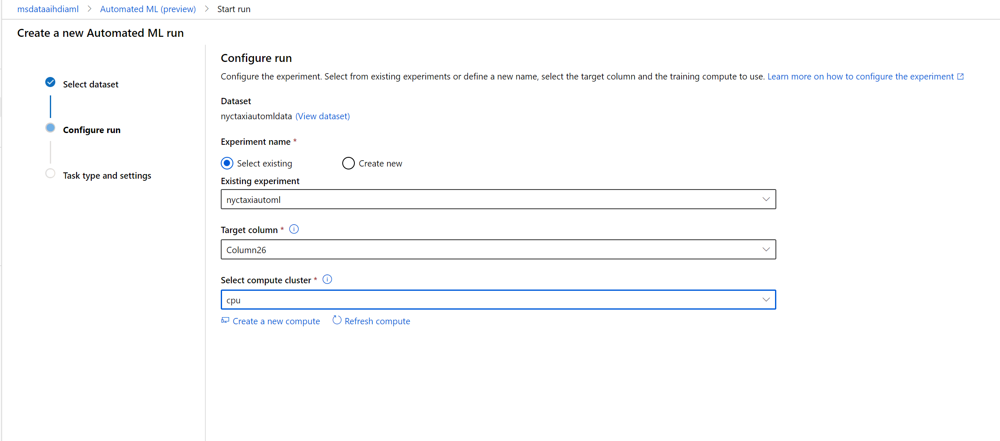
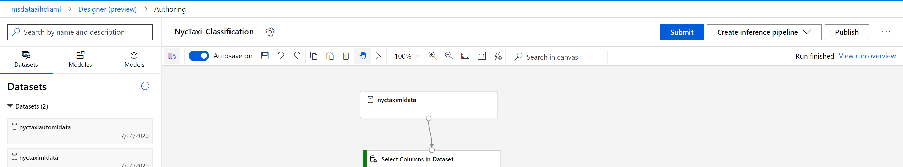
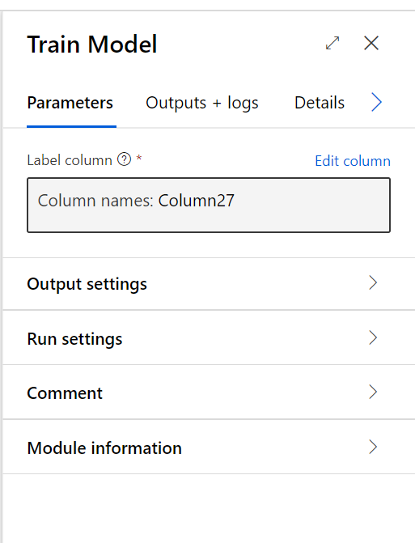

# Table of Content
[Abstract ](#abstract)

[Target Audience ](#target-audience) 

[Technologies](#technologies)

[Objective](#objective)

[HDInsight Features and Capabilities](#hdinsight-features-and-capabilities)

[Workshop Architecture and Overview](#workshop-architecture-and-overview)
   
[Special Thanks](#special-thanks)   

 # Abstract
Big data analytics has evolved rapidly in the last decade. This evolution has also transpired a innovation in tooling resulting a large set of tools available for the enterprise data analytics and management teams. As part of highlighting the key pros and limitation in a tool chain, this particular workshop will focus on HDInsight has a central component of the design. At the end of the workshop the participants will be able to understand and implement simple end to end data analytics design using HDInsight and supported tooling. Further, this experience will help participants both Sales representatives and customers to identify workloads that might suit HDInsight and perform quick Demos/POCs. 

Azure HDInsight is a cloud service that allows cost-effective data processing using open-source frameworks such as Hadoop, Spark, Hive, Storm, and Kafka, among others. Of all Azure’s cloud-based ETL technologies, HDInsight is the closest to an IaaS, since there is some amount of cluster management involved. Billing is on a per-minute basis, but activities can be scheduled on demand using Data Factory, even though this limits the use of storage to Blob Storage. Another key feature of HDInsight is that it maintains the ability of integrating to native azure services such Azure Machine Learning, data factory while allowing you to bring in/build your opensource tool chain.

# Target Audience
- Data Engineers 
- Data analysts 
- Machine learning engineers
- Data and AI sales

# Technologies 
- HDInsight - Kafka
- HDInsight – Machine Learning/R Server
- HDInsight – Spark
- Azure Machine Learning
- Power BI
- Azure Data Lake

# Objective
## Business Objectives 
The key goal for the end enterprise business user is the ability to see the descriptive analytics of the entire disparate dataset as a single source of truth. This might allow them answer business questions such as “Average ride time in May 2013 for Yellow Taxis” or “Variation of ride volume by hour on weekdays vs weekends”. In addition, enterprise business users might want a dynamic dashboard that allows them the chop and slice their views at runtime. Further, end users might also want predictive analytics solutions such as “Probability of receiving a tip” or “Overall demand for taxis in a particular borough on a Sunday”. The final frontier for an enterprise user will be to get to prescriptive analytics from the dataset and generate recommendations such as dynamic fair pricing.  
 
 
## Technical Objectives 
The technical goals for the demo stem from the needs of the enterprise business user, the scale of the dataset and the differences in data profile across taxi types, years and month. In order to create a single source of truth (materialized view), for the entire enterprise, the data analytics solution should be able to homogenize the data across taxi types and time which can be fairly challenging for datasets this big with over 1.6 Billion records.  Additionally, to allow business users to dynamically slice and chop their views on run time, all queries should have very low latency. To support predictive and perspective analytics our solution should allow Machine learning to be applied to the entire data set. Further, the architecture for the solution should be scalable for future expansion and support Devops like continuous ingestion and production. 

# HDInsight Features and Capabilities

Azure HDInsight is a managed, full-spectrum, open-source analytics service in
the cloud for enterprises. You can use open-source frameworks such as Hadoop,
Apache Spark, Apache Hive, LLAP, Apache Kafka, Apache Storm, R, and more.

Azure HDInsight makes it easy, fast, and cost-effective to process massive
amounts of data. You can use the most popular open-source frameworks such as
Hadoop, Spark, Hive, LLAP, Kafka, Storm, R, and more. With these frameworks, you
can enable a broad range of scenarios such as extract, transform, and load
(ETL), data warehousing, machine learning, and IoT.

To see available Hadoop technology stack components on HDInsight,
see [Components and versions available with
HDInsight](https://docs.microsoft.com/en-us/azure/hdinsight/hdinsight-component-versioning).
To read more about Hadoop in HDInsight, see the [Azure features page for
HDInsight.](https://azure.microsoft.com/services/hdinsight/)

This section lists the capabilities of Azure HDInsight.

| **Capability**        | **Description**                                                                                                                                                                                                                                                                                                                                                                                                                                                                                                                                                                                                                                                                                                                                                                                                                                                                                                |
|-----------------------|----------------------------------------------------------------------------------------------------------------------------------------------------------------------------------------------------------------------------------------------------------------------------------------------------------------------------------------------------------------------------------------------------------------------------------------------------------------------------------------------------------------------------------------------------------------------------------------------------------------------------------------------------------------------------------------------------------------------------------------------------------------------------------------------------------------------------------------------------------------------------------------------------------------|
| Cloud native          | Azure HDInsight enables you to create optimized clusters for [Hadoop](https://docs.microsoft.com/en-us/azure/hdinsight/hadoop/apache-hadoop-linux-tutorial-get-started), [Spark](https://docs.microsoft.com/en-us/azure/hdinsight/spark/apache-spark-jupyter-spark-sql), [Interactive query (LLAP)](https://docs.microsoft.com/en-us/azure/hdinsight/interactive-query/apache-interactive-query-get-started), [Kafka](https://docs.microsoft.com/en-us/azure/hdinsight/kafka/apache-kafka-get-started), [Storm](https://docs.microsoft.com/en-us/azure/hdinsight/storm/apache-storm-tutorial-get-started-linux), [HBase](https://docs.microsoft.com/en-us/azure/hdinsight/hbase/apache-hbase-tutorial-get-started-linux), and [ML Services](https://docs.microsoft.com/en-us/azure/hdinsight/r-server/r-server-overview) on Azure. HDInsight also provides an end-to-end SLA on all your production workloads. |
| Low-cost and scalable | HDInsight enables you to [scale](https://docs.microsoft.com/en-us/azure/hdinsight/hdinsight-administer-use-portal-linux#scale-clusters) workloads up or down. You can reduce costs by [creating clusters on demand](https://docs.microsoft.com/en-us/azure/hdinsight/hdinsight-hadoop-create-linux-clusters-adf) and paying only for what you use. You can also build data pipelines to operationalize your jobs. Decoupled compute and storage provide better performance and flexibility.                                                                                                                                                                                                                                                                                                                                                                                                                    |
| Secure and compliant  | HDInsight enables you to protect your enterprise data assets with [Azure Virtual Network](https://docs.microsoft.com/en-us/azure/hdinsight/hdinsight-plan-virtual-network-deployment), [encryption](https://docs.microsoft.com/en-us/azure/hdinsight/hdinsight-hadoop-create-linux-clusters-with-secure-transfer-storage), and integration with [Azure Active Directory](https://docs.microsoft.com/en-us/azure/hdinsight/domain-joined/hdinsight-security-overview). HDInsight also meets the most popular industry and government [compliance standards](https://azure.microsoft.com/overview/trusted-cloud).                                                                                                                                                                                                                                                                                                |
| Monitoring            | Azure HDInsight integrates with [Azure Monitor logs](https://docs.microsoft.com/en-us/azure/hdinsight/hdinsight-hadoop-oms-log-analytics-tutorial) to provide a single interface with which you can monitor all your clusters.                                                                                                                                                                                                                                                                                                                                                                                                                                                                                                                                                                                                                                                                                 |
| Global availability   | HDInsight is available in more [regions](https://azure.microsoft.com/regions/services/) than any other big data analytics offering. Azure HDInsight is also available in Azure Government, China, and Germany, which allows you to meet your enterprise needs in key sovereign areas.                                                                                                                                                                                                                                                                                                                                                                                                                                                                                                                                                                                                                          |
| Productivity          | Azure HDInsight enables you to use rich productive tools for Hadoop and Spark with your preferred development environments. These development environments include [Visual Studio](https://docs.microsoft.com/en-us/azure/hdinsight/hadoop/apache-hadoop-visual-studio-tools-get-started), VSCode, [Eclipse](https://docs.microsoft.com/en-us/azure/hdinsight/spark/apache-spark-eclipse-tool-plugin), and [IntelliJ](https://docs.microsoft.com/en-us/azure/hdinsight/spark/apache-spark-intellij-tool-plugin) for Scala, Python, R, Java, and .NET support. Data scientists can also collaborate using popular notebooks such as Jupyter and [Zeppelin](https://docs.microsoft.com/en-us/azure/hdinsight/spark/apache-spark-zeppelin-notebook).                                                                                                                                                              |
| Extensibility         | You can extend the HDInsight clusters with installed components (Hue, Presto, and so on) by using [script actions](https://docs.microsoft.com/en-us/azure/hdinsight/hdinsight-hadoop-customize-cluster-linux), by [adding edge nodes](https://docs.microsoft.com/en-us/azure/hdinsight/hdinsight-apps-use-edge-node), or by [applications](https://docs.microsoft.com/en-us/azure/hdinsight/hdinsight-apps-install-applications). HDInsight enables seamless integration with the most popular big data solutions with a [one-click](https://azure.microsoft.com/services/hdinsight/partner-ecosystem/) deployment.                                                                                                                                                                                                                                                                                            |

Azure HDInsight can be used for a variety of scenarios in big data processing.
It can be historical data (data that's already collected and stored) or
real-time data (data that's directly streamed from the source). The scenarios
for processing such data can be summarized in the following categories:

**Batch processing (ETL)**

Extract, transform, and load (ETL) is a process where unstructured or structured
data is extracted from heterogeneous data sources. It's then transformed into a
structured format and loaded into a data store. You can use the transformed data
for data science or data warehousing.

**Data warehousing**

You can use HDInsight to perform interactive queries at petabyte scales over
structured or unstructured data in any format. You can also build models
connecting them to BI tools. For more information, [read this customer
story](https://customers.microsoft.com/story/milliman).

**Internet of Things (IoT)**

You can use HDInsight to process streaming data that's received in real time
from different kinds of devices. For more information, [read this blog post from
Azure that announces the public preview of Apache Kafka on HDInsight with Azure
Managed
disks](https://azure.microsoft.com/blog/announcing-public-preview-of-apache-kafka-on-hdinsight-with-azure-managed-disks/).

**Data science**

You can use HDInsight to build applications that extract critical insights from
data. You can also use Azure Machine Learning on top of that to predict future
trends for your business. For more information, [read this customer
story](https://customers.microsoft.com/story/pros).

HDInsight includes specific cluster types and cluster customization
capabilities, such as the capability to add components, utilities, and
languages. HDInsight offers the following cluster types:

| **Cluster Type**                                                                                                                    | **Description**                                                                                                                                                                                                                                                                                                                               |
|-------------------------------------------------------------------------------------------------------------------------------------|-----------------------------------------------------------------------------------------------------------------------------------------------------------------------------------------------------------------------------------------------------------------------------------------------------------------------------------------------|
| [Apache Hadoop](https://docs.microsoft.com/en-us/azure/hdinsight/hadoop/apache-hadoop-introduction)                                 | A framework that uses HDFS, YARN resource management, and a simple MapReduce programming model to process and analyze batch data in parallel.                                                                                                                                                                                                 |
| [Apache Spark](https://docs.microsoft.com/en-us/azure/hdinsight/spark/apache-spark-overview)                                        | An open-source, parallel-processing framework that supports in-memory processing to boost the performance of big-data analysis applications. See [What is Apache Spark in HDInsight?](https://docs.microsoft.com/en-us/azure/hdinsight/spark/apache-spark-overview).                                                                          |
| [Apache HBase](https://docs.microsoft.com/en-us/azure/hdinsight/hbase/apache-hbase-overview)                                        | A NoSQL database built on Hadoop that provides random access and strong consistency for large amounts of unstructured and semi-structured data--potentially billions of rows times millions of columns. See [What is HBase on HDInsight?](https://docs.microsoft.com/en-us/azure/hdinsight/hbase/apache-hbase-overview)                       |
| [ML Services](https://docs.microsoft.com/en-us/azure/hdinsight/r-server/r-server-overview)                                          | A server for hosting and managing parallel, distributed R processes. It provides data scientists, statisticians, and R programmers with on-demand access to scalable, distributed methods of analytics on HDInsight. See [Overview of ML Services on HDInsight](https://docs.microsoft.com/en-us/azure/hdinsight/r-server/r-server-overview). |
| [Apache Storm](https://docs.microsoft.com/en-us/azure/hdinsight/storm/apache-storm-overview)                                        | A distributed, real-time computation system for processing large streams of data fast. Storm is offered as a managed cluster in HDInsight. See [Analyze real-time sensor data using Storm and Hadoop](https://docs.microsoft.com/en-us/azure/hdinsight/storm/apache-storm-overview).                                                          |
| [Apache Interactive Query](https://docs.microsoft.com/en-us/azure/hdinsight/interactive-query/apache-interactive-query-get-started) | In-memory caching for interactive and faster Hive queries. See [Use Interactive Query in HDInsight](https://docs.microsoft.com/en-us/azure/hdinsight/interactive-query/apache-interactive-query-get-started).                                                                                                                                 |
| [Apache Kafka](https://docs.microsoft.com/en-us/azure/hdinsight/kafka/apache-kafka-introduction)                                    | An open-source platform that's used for building streaming data pipelines and applications. Kafka also provides message-queue functionality that allows you to publish and subscribe to data streams. See [Introduction to Apache Kafka on HDInsight](https://docs.microsoft.com/en-us/azure/hdinsight/kafka/apache-kafka-introduction).      |

# Workshop Architecture and Overview

In this workshop, in an end-to-end scenario, we use an [Azure HDInsight Hadoop
cluster](https://azure.microsoft.com/services/hdinsight/)s to store, explore,
and feature-engineer data from the publicly available [NYC Taxi
Trips ](https://www.andresmh.com/nyctaxitrips/)dataset. To handle binary and
multiclass classification and regression predictive tasks, we build models of
the data using Spark on HDInsight Cluster as well as building models in R.  We
will also use Azure Machine Learning services to build those models.

For our workshop, following is the high-level architecture:

Process Steps:

1.  Create Clusters in Azure Virtual Network.

2.  Download required tools and code.

3.  Ingest the raw data from source.

4.  Create Hive database and tables.

5.  Load and partition the data into the Hive table.

6.  Data exploration and Feature Engineering in Hive.

7.  Data Science using Python, SQL and Spark.

8.  Data Science using R

9.  Real-time and batch streaming on Kafka.

10. Build models using Azure Machine Learning Services.

# Step 1 – Create Cluster in Azure Virtual Network

## Deploy Spark, Kafka, R Clusters and AML Service using ARM Template

-   To deploy a customized template through the portal, select Create a
    resource, search for template. and then select Template deployment.

    

-   Select **Create**.

-   You see several options for creating a template:

    -   **Build your own template in editor**: create a template using the
        portal template editor. The editor is capable to add a resource template
        schema.

    -   **Common templates**: There are four common templates for creating a
        Linux virtual machine, Windows virtual machine, a web application, and a
        database in Azure SQL Database.

    -   **Load a GitHub quickstart template**: use an existing quickstart
        templates.

        

-   Under Learn about template deployment, Select build your own template in the
    editor

-   Copy content of attached json file in the editor window

-   Click Save. Now you see the portal template deployment interface. Notice the
    eight parameters that you defined in the template.

-   Enter or select the property values:

    -   Subscription: Select an Azure subscription.

    -   Resource group: Select Create new and give a name.

    -   Location: Select an Azure location.

    -   Unique Name: Provide unique name that will be used for resource creation

    -   Cluster Login Name: Use the default value.

    -   Cluster Login Password:

    -   Ssh User Name: Use the default value.

    -   Ssh Password:

-   I agree to the terms and conditions stated above: (select)

-   Click Purchase.

Template will deploy Spark, Kafka and Machine Learning Server Clusters. The
Kafka service is limited to communication within the virtual network. Other
services on the cluster, such as SSH and Ambari, can be accessed over the
internet. For more information on the public ports available with HDInsight,
see [Ports and URIs used by
HDInsight.](https://docs.microsoft.com/en-us/azure/hdinsight/hdinsight-hadoop-port-settings-for-services)
The template above contains all 3 HDInsight Clusters located within an Azure
Virtual Network, which allows the Spark cluster to directly communicate with the
Kafka cluster.

**Note**

**It can take up to 20 minutes to create the clusters.**

## Assign Built-in RBAC role

-   In the [Azure portal](https://portal.azure.com/), go to your storage account
    that was deployed via the script and display the **Overview** for the
    account.

-   Under Services, select **Blobs**.

-   Select **Access control (IAM)** to display access control settings for the
    storage account. Select the **Role assignments** tab to see the list of role
    assignments.

-   Click the **Add role assignment** button to add a new role.

-   In the **Add role assignment** window, select following

    -   Role – Storage Blob Data Owner

    -   Assign access to – Azure AD user, group or service principal

    -   Select - **\<account that you logged in to the portal\>.**

-   Click Save

-   The identity to whom you assigned the role appears listed under that role. 

# Step 2 – Download required tools and code

## Download AzCopy

AzCopy is a command-line utility that you can use to copy blobs or files to or
from a storage account. This article helps you download AzCopy, connect to your
storage account, and then transfer files.

First, download the AzCopy V10 executable file to any directory on your
computer. AzCopy V10 is just an executable file, so there's nothing to install.

-   Windows 64-bit (zip)

-   Windows 32-bit (zip)

-   Linux x86-64 (tar)

-   MacOS (zip)

These files are compressed as a zip file (Windows and Mac) or a tar file
(Linux). To download and decompress the tar file on Linux, see the documentation
for your Linux distribution.

## Download SshClient

Download SshClient (like Putty) to connect to HDInsight clusters using SSH.

<https://www.chiark.greenend.org.uk/~sgtatham/putty/latest.html>

## Download JQ

jq is a lightweight and flexible command-line JSON processor. jq is like sed for
JSON data - you can use it to slice and filter and map and transform structured
data with the same ease that sed, awk, grep and friends let you play with text.
Jq will be used during Kafka structure streaming workshop.

[Windows
64-bit](https://github.com/stedolan/jq/releases/download/jq-1.6/jq-win64.exe)

[MacOS](https://github.com/stedolan/jq/releases/download/jq-1.6/jq-osx-amd64)

[Linux
64-bit](https://github.com/stedolan/jq/releases/download/jq-1.6/jq-linux64)

# Step 3 – Ingest raw data from source 

## Copy NycTaxi Raw data

The NYC Taxi Trip data is about 20 GB of compressed comma-separated values (CSV)
files (\~48 GB uncompressed). It has more than 173 million individual trips, and
includes the fares paid for each trip. Each trip record includes the pick-up and
dropoff location and time, anonymized hack (driver's) license number, and
medallion number (the taxi’s unique ID). The data covers all trips in the year
2013, and is provided in the following two datasets for each month:

The trip_data CSV files contain trip details: the number of passengers, pick up
and dropoff points, trip duration, and trip length. Here are a few sample
records:

-   medallion,hack_license,vendor_id,rate_code,store_and_fwd_flag,pickup_datetime,dropoff_datetime,passenger_count,trip_time_in_secs,trip_distance,pickup_longitude,pickup_latitude,dropoff_longitude,dropoff_latitude

-   89D227B655E5C82AECF13C3F540D4CF4,BA96DE419E711691B9445D6A6307C170,CMT,1,N,2013-01-01
    15:11:48,2013-01-01
    15:18:10,4,382,1.00,-73.978165,40.757977,-73.989838,40.751171

-   0BD7C8F5BA12B88E0B67BED28BEA73D8,9FD8F69F0804BDB5549F40E9DA1BE472,CMT,1,N,2013-01-06
    00:18:35,2013-01-06
    00:22:54,1,259,1.50,-74.006683,40.731781,-73.994499,40.75066

-   0BD7C8F5BA12B88E0B67BED28BEA73D8,9FD8F69F0804BDB5549F40E9DA1BE472,CMT,1,N,2013-01-05
    18:49:41,2013-01-05
    18:54:23,1,282,1.10,-74.004707,40.73777,-74.009834,40.726002

-   DFD2202EE08F7A8DC9A57B02ACB81FE2,51EE87E3205C985EF8431D850C786310,CMT,1,N,2013-01-07
    23:54:15,2013-01-07
    23:58:20,2,244,.70,-73.974602,40.759945,-73.984734,40.759388

-   DFD2202EE08F7A8DC9A57B02ACB81FE2,51EE87E3205C985EF8431D850C786310,CMT,1,N,2013-01-07
    23:25:03,2013-01-07
    23:34:24,1,560,2.10,-73.97625,40.748528,-74.002586,40.747868

The trip_fare CSV files contain details of the fare paid for each trip: payment
type, fare amount, surcharge and taxes, tips and tolls, and the total amount
paid. Here are a few sample records:

-   medallion, hack_license, vendor_id, pickup_datetime, payment_type,
    fare_amount, surcharge, mta_tax, tip_amount, tolls_amount, total_amount

-   89D227B655E5C82AECF13C3F540D4CF4,BA96DE419E711691B9445D6A6307C170,CMT,2013-01-01
    15:11:48,CSH,6.5,0,0.5,0,0,7

-   0BD7C8F5BA12B88E0B67BED28BEA73D8,9FD8F69F0804BDB5549F40E9DA1BE472,CMT,2013-01-06
    00:18:35,CSH,6,0.5,0.5,0,0,7

-   0BD7C8F5BA12B88E0B67BED28BEA73D8,9FD8F69F0804BDB5549F40E9DA1BE472,CMT,2013-01-05
    18:49:41,CSH,5.5,1,0.5,0,0,7

-   DFD2202EE08F7A8DC9A57B02ACB81FE2,51EE87E3205C985EF8431D850C786310,CMT,2013-01-07
    23:54:15,CSH,5,0.5,0.5,0,0,6

-   DFD2202EE08F7A8DC9A57B02ACB81FE2,51EE87E3205C985EF8431D850C786310,CMT,2013-01-07
    23:25:03,CSH,9.5,0.5,0.5,0,0,10.5

The unique key to join trip_data and trip_fare is composed of the fields:
medallion, hack_license, and pickup_datetime. To get all the details relevant to
a particular trip, it is sufficient to join with these three keys.

  
**Examples of prediction tasks**

Determine the kind of predictions you want to make based on data analysis to
help clarify the required process tasks. Here are three examples of prediction
problems that we address in this walkthrough, all based on the *tip_amount*:

-   **Binary classification**: Predict whether a tip was paid for a trip. That
    is, a *tip_amount* that is greater than \$0 is a positive example, while
    a *tip_amount* of \$0 is a negative example.

    -   Class 0: tip_amount = \$0

    -   Class 1: tip_amount \> \$0

-   **Multiclass classification**: Predict the range of tip amounts paid for the
    trip. We divide the *tip_amount* into five classes:

    -   Class 0: tip_amount = \$0

    -   Class 1: tip_amount \> \$0 and tip_amount \<= \$5

    -   Class 2: tip_amount \> \$5 and tip_amount \<= \$10

    -   Class 3: tip_amount \> \$10 and tip_amount \<= \$20

    -   Class 4: tip_amount \> \$20

-   **Regression task**: Predict the amount of the tip paid for a trip.

To copy the [NYC Taxi Trips](https://www.andresmh.com/nyctaxitrips/) dataset to
your machine from its public location, use any of the methods described in [Move
data to and from Azure Blob
storage](https://docs.microsoft.com/en-us/azure/machine-learning/team-data-science-process/move-azure-blob).

Here, we describe how to use AzCopy to transfer the files containing data. To
download and install AzCopy, follow the instructions at  [command-line
utility](https://docs.microsoft.com/en-us/azure/storage/common/storage-use-azcopy).

From a command prompt window, login to the azure subscription so that we don’t
need to provide SAS token or the keys for the destination account using **Azcopy
login** command.

Next, from a command prompt window, run the following AzCopy commands,
replacing \<path_to_data_folder\> with the desired destination (storage account
that was created by template):

azcopy cp "<https://msdataainyctaxi.blob.core.windows.net/nyctaxi/nyctaxiraw/>"
"[.blob.core.windows.net/hdidatalake]()" --recursive=true

When the copy completes, you will see a total of 24 files in the nyctaxiraw
folder. 12 Files in trip and 12 files in fare directory.

## Copy Notebooks

From a command prompt window, run the following AzCopy commands,
replacing \<path_to_data_folder\> with the desired destination (storage account
that was created by template) to copy the Juypter notebook, R Code and SQL
commands that will be used throughout the workshop:

azcopy cp "<https://msdataainyctaxi.blob.core.windows.net/nyctaxi/notebooks/*>"
"[.blob.core.windows.net/hdidatalake/HdiNotebooks]()" --recursive=true

# Step 4 – Create Hive database and tables

[Jupyter](https://jupyter.org/) Notebook is an interactive notebook environment
that supports various programming languages. The notebook allows you to interact
with your data, combine code with markdown text, and perform simple
visualizations.

-   Select **HDInsight clusters**, and then select the cluster you created.

-   From the portal, in **Cluster dashboards** section, select **Jupyter
    Notebook**. If prompted, enter the cluster login credentials for the
    cluster.

-   Open Create Database and Tables.ipynb

-   Execute Cell 1 to create hive database

-   Execute rest of the cells to create the trip and fare hive tables

Above Hive script creates two tables:

-   The trip table contains trip details of each ride (driver details, pick-up
    time, trip distance, and times).

-   The fare table contains fare details (fare amount, tip amount, tolls, and
    surcharges).

# Step 5 – Load and partition the data into Hive Table

The NYC taxi dataset has a natural partitioning by month, which we use to enable
faster processing and query times.

You can run hive queries by using Apache Ambari Hive View. The Hive View allows
you to author, optimize, and run Hive queries from your web browser.

-   From the [Azure portal](https://portal.azure.com/), select your cluster.
    See [List and show
    clusters](https://docs.microsoft.com/en-us/azure/hdinsight/hdinsight-administer-use-portal-linux#showClusters) for
    instructions. The cluster is opened in a new portal view.

-   From **Cluster dashboards**, select **Ambari views**. When prompted to
    authenticate, use the cluster login (default admin) account name and
    password that you provided when you created the cluster. You can also
    navigate to https://CLUSTERNAME.azurehdinsight.net/\#/main/views in your
    browser where CLUSTERNAME is the name of your cluster.

-   From the list of views, select **Hive View**.

-   The Hive view page is like the following image:

-   From the **Query** tab, paste the following HiveQL statements into the
    worksheet to create partitioned trip data:

    -   LOAD DATA INPATH '/nyctaxiraw/trip/trip_data_1.csv' INTO TABLE
        nyctaxidb.trip PARTITION (month=1);

    -   LOAD DATA INPATH '/nyctaxiraw/trip/trip_data_2.csv' INTO TABLE
        nyctaxidb.trip PARTITION (month=2);

    -   LOAD DATA INPATH '/nyctaxiraw/trip/trip_data_3.csv' INTO TABLE
        nyctaxidb.trip PARTITION (month=3);

    -   LOAD DATA INPATH '/nyctaxiraw/trip/trip_data_4.csv' INTO TABLE
        nyctaxidb.trip PARTITION (month=4);

    -   LOAD DATA INPATH '/nyctaxiraw/trip/trip_data_5.csv' INTO TABLE
        nyctaxidb.trip PARTITION (month=5);

    -   LOAD DATA INPATH '/nyctaxiraw/trip/trip_data_6.csv' INTO TABLE
        nyctaxidb.trip PARTITION (month=6);

    -   LOAD DATA INPATH '/nyctaxiraw/trip/trip_data_7.csv' INTO TABLE
        nyctaxidb.trip PARTITION (month=7);

    -   LOAD DATA INPATH '/nyctaxiraw/trip/trip_data_8.csv' INTO TABLE
        nyctaxidb.trip PARTITION (month=8);

    -   LOAD DATA INPATH '/nyctaxiraw/trip/trip_data_9.csv' INTO TABLE
        nyctaxidb.trip PARTITION (month=9);

    -   LOAD DATA INPATH '/nyctaxiraw/trip/trip_data_10.csv' INTO TABLE
        nyctaxidb.trip PARTITION (month=10);

    -   LOAD DATA INPATH '/nyctaxiraw/trip/trip_data_11.csv' INTO TABLE
        nyctaxidb.trip PARTITION (month=11);

    -   LOAD DATA INPATH '/nyctaxiraw/trip/trip_data_12.csv' INTO TABLE
        nyctaxidb.trip PARTITION (month=12);

-   From the **Query** tab, paste the following HiveQL statements into the
    worksheet to create partitioned fare data:

    -   LOAD DATA INPATH '/nyctaxiraw/fare/trip_fare_1.csv' INTO TABLE
        nyctaxidb.fare PARTITION (month=1);

    -   LOAD DATA INPATH '/nyctaxiraw/fare/trip_fare_2.csv' INTO TABLE
        nyctaxidb.fare PARTITION (month=2);

    -   LOAD DATA INPATH '/nyctaxiraw/fare/trip_fare_3.csv' INTO TABLE
        nyctaxidb.fare PARTITION (month=3);

    -   LOAD DATA INPATH '/nyctaxiraw/fare/trip_fare_4.csv' INTO TABLE
        nyctaxidb.fare PARTITION (month=4);

    -   LOAD DATA INPATH '/nyctaxiraw/fare/trip_fare_5.csv' INTO TABLE
        nyctaxidb.fare PARTITION (month=5);

    -   LOAD DATA INPATH '/nyctaxiraw/fare/trip_fare_6.csv' INTO TABLE
        nyctaxidb.fare PARTITION (month=6);

    -   LOAD DATA INPATH '/nyctaxiraw/fare/trip_fare_7.csv' INTO TABLE
        nyctaxidb.fare PARTITION (month=7);

    -   LOAD DATA INPATH '/nyctaxiraw/fare/trip_fare_8.csv' INTO TABLE
        nyctaxidb.fare PARTITION (month=8);

    -   LOAD DATA INPATH '/nyctaxiraw/fare/trip_fare_9.csv' INTO TABLE
        nyctaxidb.fare PARTITION (month=9);

    -   LOAD DATA INPATH '/nyctaxiraw/fare/trip_fare_10.csv' INTO TABLE
        nyctaxidb.fare PARTITION (month=10);

    -   LOAD DATA INPATH '/nyctaxiraw/fare/trip_fare_11.csv' INTO TABLE
        nyctaxidb.fare PARTITION (month=11);

    -   LOAD DATA INPATH '/nyctaxiraw/fare/trip_fare_12.csv' INTO TABLE
        nyctaxidb.fare PARTITION (month=12);

**Note** : More details on using Hive view with HDInsight is documented at
<https://docs.microsoft.com/en-us/azure/hdinsight/hadoop/apache-hadoop-use-hive-ambari-view>  

# Step 6 – Data Exploration and Feature Engineering in Hive

You can use Hive queries to accomplish data exploration and feature engineering
tasks for the data loaded into the Hive tables. Here are examples of such tasks:

-   View the top 10 records in both tables.

-   Explore data distributions of a few fields in varying time windows.

-   Investigate data quality of the longitude and latitude fields.

-   Generate binary and multiclass classification labels based on the tip
    amount.

-   Generate features by computing the direct trip distances.

Open Data Exploration Python notebook (Data Exploration.ipynb)

-   To see what the data looks like, examine 10 records from each table. To
    inspect the records, run the following cell.

-   To get the top 10 records in the trip table from the first month:

-   View the number of records in each of the 12 partitions. Of interest is how
    the number of trips varies during the calendar year. Grouping by month shows
    the distribution of trips.

-   Here, the first column is the month, and the second is the number of trips
    for that month.

-   We can also count the total number of records in our trip dataset by running
    the following command.

-   This example identifies the medallions (taxi numbers) with greater than 100
    trips within a given time. The query benefits from the partitioned table
    access because it is conditioned by the partition variable **month**.  The
    medallion in the NYC taxi dataset identifies a unique cab. You can identify
    which cabs are comparatively busy by asking which ones made more than a
    certain number of trips in a particular time. The following example
    identifies cabs that made more than a hundred trips in the first three
    months

-   When exploring a dataset, we frequently want to examine the distributions of
    groups of values. This section provides an example of how to do this
    analysis for cabs and drivers. This query returns cab and driver
    combinations, ordered by descending number of trips.

-   A common objective of exploratory data analysis is to weed out invalid or
    bad records. The example in this section determines whether either the
    longitude or latitude fields contain a value far outside the NYC area. Since
    it is likely that such records have an erroneous longitude-latitude value,
    we want to eliminate them from any data that is to be used for modeling.

-   For the binary classification problem outlined in the Examples of prediction
    tasks section, it is useful to know whether a tip was given or not. This
    distribution of tips is binary:

    -   tip given (Class 1, tip_amount \> \$0)

    -   no tip (Class 0, tip_amount = \$0)

-   For the multiclass classification problem outlined in the Examples of
    prediction tasks section, this dataset also lends itself to a natural
    classification to predict the amount of the tips given. We can use bins to
    define tip ranges in the query. 

    

-   You might want to know if there is a difference between the direct distance
    between two locations, and the actual trip distance of the taxi. A passenger
    might be less likely to tip if they figure out that the driver has
    intentionally taken them by a longer route.

-   To see the comparison between actual trip distance and the [Haversine
    distance](https://en.wikipedia.org/wiki/Haversine_formula) between two
    longitude-latitude points (the "great circle" distance), you can use the
    trigonometric functions available within Hive

-   In the preceding query, R is the radius of the Earth in miles, and pi is
    converted to radians. The longitude-latitude points are filtered to remove
    values that are far from the NYC area.

# Step 7 – Data Science using Python, SQL and Spark

For this section of the workshop we show key features and capabilities of
Spark's MLlib toolkit using the NYC taxi trip and fare data-set from 2013 (about
40 Gb uncompressed). We take about 10% of the sample of this data (from the
month of December 2013, about 3.6 Gb) to predict the amount of tip paid for each
taxi trip in NYC based on features such as trip distance, number of passengers,
trip distance etc. We have shown relevant plots in Python. We are sampling the
data in order for the runs to finish quickly. The same code (with minor
modifications) can be run on the full 2013 data-set.

The Data science lifecycle outlines the major stages that projects typically
execute, often iteratively:

-   Business understanding

-   Data acquisition and understanding

-   Modeling

-   Deployment

-   Customer acceptance

Here is a visual representation of the Datascience lifecycle:

To predict the amount of tip paid in dollars for each taxi trip, we will follow
steps below in the Juypter notebook.

-   Data ingestion, joining, and wrangling.

-   Data exploration and plotting.

-   Data preparation (featurizing/transformation).

-   Modeling (using incl. hyperparameter tuning with cross-validation),
    prediction, model persistence.

-   Model evaluation on an independent validation data-set.

Through the above steps we highlight Spark SQL, as well as, MLlib's modeling and
transformation functions.

Open NycTaxi Regression Python notebook (NycTaxi_Regression.ipynb)

-   Set directory paths and location of training, validation files, as well as
    model location in blob storage

-   Set SQL context and import necessary libraries

-   Use the existing Hive tables that we have created in earlier step and create
    spark dataframe.

-   Besides Python and Scala, we can write SQL statement within the notebook.
    Using Spark SQL join the data from trip and fare table and create temporary
    view.

-   For our workshop, we are going to sample the 10% of the data for building
    and evaluation model.  We will further split that data into training and
    validation dataset.

-   Now that we have the sampled joined dataset, we can drop the un-necessary
    column and filter for any undesired our outlier values to create clean
    dataset

-   On the clean dataset, we can do data exploration and visualization by
    plotting target variables and features, like plotting tip amount and
    relationship between tip amount vs other features.

-   Training data consists of a matrix composed of rows and columns. Each row in
    the matrix is an observation or record. The columns of each row are the
    features that describe each record. The features specified in the
    experimental design should characterize the patterns in the data. Although
    many of the raw data fields can be used directly to train a model, it's
    often necessary to create additional (engineered) features for an enhanced
    training dataset. Engineered features that enhance training provide
    information that better differentiates the patterns in the data. But this
    process is something of an art. Sound and productive decisions often require
    domain expertise.

-   We will create a new feature by binning hours into traffic time buckets and
    index the categorical features.

-   Once we have the feature engineered data, next step in the process is to
    split training and test data before training the model. Training fraction
    will be used to create model, and testing fraction will be used to evaluate
    model.

-   Now you can build the regression model to predict the amount of tip paid for
    taxi trips. We are showcasing multiple algorithm for building regression
    model (GBT, Random Forest and Linear Regression)

-   Once the model is built, you can plot the actual vs predicted value based on
    the model.

-   You can also do hyper parameter tuning and cross validation of model.

-   Once the evaluation of the model is done on test data, the model is
    persisted into storage account for batch operation. Prediction also can be
    persisted into HDFS for visualization into BI tools or for any other backend
    processes.

# Step 8 – Data Science using R

When it comes to scalable data analysis and ML, many data scientists are blocked
or hindered by a variety of issues, such as the limitations of available
functions to handle large data-sets efficiently, access to or knowledge about
the appropriate infrastructure, and ability to produce operationalized pipelines
and models that can be consumed easily in production. For this section of the
workshop we will show how to use Microsoft R server and HDInsight to help solve
these issues. Most functions in open-source R operate on data-sets that fit in
memory and cannot be distributed easily to run in Hadoop/MapReduce context. This
creates severe challenges for data scientists to use these open-source R
functions for scalable data analysis with big data-sets which are in the order
of 10’s of Gbs or Terabytes. Microsoft’s R-server (MRS) running on distributed
computing environments, such as Hadoop MapReduce and Spark, can be a valuable
solution for scalable data analytics using R. We will go over an example of how
to do data exploration and modeling with Microsoft R server (MRS) on a HDInsight
Hadoop cluster using MapReduce. The data used for this exercise is the public
NYC Taxi Trip and Fare data-set (2013, \~40 Gb, \~170 million rows) that we are
using throughout the workshop.

Microsoft Machine Learning Server is available as a deployment option when you
create HDInsight clusters in Azure. The cluster type that provides this option
is called **ML Services**. This capability provides on-demand access to
adaptable, distributed methods of analytics on HDInsight.

ML Services on HDInsight provides the latest capabilities for R-based analytics
on datasets of virtually any size. The datasets can be loaded to either Azure
Blob or Data Lake storage. Your R-based applications can use the 8000+
open-source R packages. The routines in ScaleR, Microsoft's big data analytics
package are also available.

The edge node provides a convenient place to connect to the cluster and run your
R scripts. The edge node allows running the ScaleR parallelized distributed
functions across the cores of the server. You can also run them across the nodes
of the cluster by using ScaleR's Hadoop Map Reduce. You can also use Apache
Spark compute contexts.

The Linux edge node of an HDInsight cluster is the landing zone for R-based
analysis. Recent versions of HDInsight provide a browser-based IDE of RStudio
Server on the edge node. RStudio Server is more productive than the R console
for development and execution.

RStudio Server runs on the cluster’s edge node. Go to the following URL
where **CLUSTERNAME** is the name of the ML Services cluster you created:

[.azurehdinsight.net/rstudio/](https://CLUSTERNAME.azurehdinsight.net/rstudio/)

The first time you sign in you need to authenticate twice. For the first
authentication prompt, provide the cluster Admin login and password, default
is admin. For the second authentication prompt, provide the SSH login and
password, default is sshuser. Subsequent sign-ins only require the SSH
credentials.

Once you are connected, your screen should resemble the following screenshot:

From the two Hive tables for taxi and fare files we created earlier and join
those the two tables we created one file. The joined file was copied to HDFS of
the HDI cluster from where it was ingested into MRS for exploration and
modeling. Files were converted to composite xdfs format prior to modeling. We
will show following steps with full NYC taxi and fare dataset:

-   Setting compute context to MapReduce

-   Data ingestion, conversion to xdf format

-   Splitting data randomly into training and testing sets

-   Performing data exploration at scale using plotting functions

-   Building linear regression and binary classification models using training
    set

-   Evaluation of the accuracy of the models on the test set

**Set compute context to MapReduce and set input/output to HDFS **

**Data ingestion, conversion to xdf format.  Note: We use the capture.output
function to divert lengthly messages/outputs from MapReduce jobs to a sink
file.**

**Splitting data randomly into training and testing sets**

**Performing data exploration at scale using plotting functions. - Generate a
histogram of tip amount grouped by passenger counts**

-   Just one example is shown here, further plots can be developed using
    functions in RevoScaleR

**Building linear regression and binary classification models using training set
-  Perform linear regression and compute correlation between predicted and
actual tip amounts**

**Evaluation of the accuracy of the models on the test set.  - Predict on test
data-set, get AUC, accuracy etc.**

# Step 9 – Real-time and Batch streaming on Kafka

[Spark Structured
Streaming](https://spark.apache.org/docs/latest/structured-streaming-programming-guide)
is a stream processing engine built on Spark SQL. It allows you to express
streaming computations the same as batch computation on static data. For this
section we are going to use [Apache Kafka on
HDInsight](https://docs.microsoft.com/en-us/azure/hdinsight/kafka/apache-kafka-get-started).

We require both Kafka and Spark clusters both located within an same Azure
Virtual Network, to allow the Spark cluster directly communicate with the Kafka
cluster.

Spark Structured Streaming is a stream processing engine built on the Spark SQL
engine. When using Structured Streaming, you can write streaming queries the
same way you write batch queries.

The following code snippets demonstrate reading from Kafka and storing to file.

**Batch Operation**

// Read a batch from Kafka

val kafkaDF = spark.read.format("kafka")

.option("kafka.bootstrap.servers", kafkaBrokers)

.option("subscribe", kafkaTopic)

.option("startingOffsets", "earliest")

.load()

// Select data and write to file

kafkaDF.select(from_json(col("value").cast("string"), schema) as "trip")

.write

.format("parquet")

.option("path","/example/batchtripdata")

.option("checkpointLocation", "/batchcheckpoint")

.save()

**Streaming Operation**

// Stream from Kafka

val kafkaStreamDF = spark.readStream.format("kafka")

.option("kafka.bootstrap.servers", kafkaBrokers)

.option("subscribe", kafkaTopic)

.option("startingOffsets", "earliest")

.load()

// Select data from the stream and write to file

kafkaStreamDF.select(from_json(col("value").cast("string"), schema) as "trip")

.writeStream

.format("parquet")

.option("path","/example/streamingtripdata")

.option("checkpointLocation", "/streamcheckpoint")

.start.awaitTermination(30000)

In both snippets, data is read from Kafka and written to file. The differences
between the examples are:

| **Batch** | **Streaming** |
|-----------|---------------|
| read      | readStream    |
| write     | writeStream   |
| save      | start         |

The streaming operation also uses awaitTermination(30000), which stops the
stream after 30,000 ms.

**Gather host information.** Use the curl and jq commands below to obtain your
Kafka ZooKeeper and broker hosts information. The commands are designed for a
Windows command prompt, slight variations will be needed for other environments.
Replace KafkaCluster with the name of your Kafka cluster, and KafkaPassword with
the cluster login password. Also, replace C:\\HDI\\jq-win64.exe with the actual
path to your jq installation. Enter the commands in a Windows command prompt and
save the output for use in later steps.

REM Enter cluster name in lowercase

set CLUSTERNAME=KafkaCluster

set PASSWORD=KafkaPassword

curl -u admin:%PASSWORD% -G
"https://%CLUSTERNAME%.azurehdinsight.net/api/v1/clusters/%CLUSTERNAME%/services/ZOOKEEPER/components/ZOOKEEPER_SERVER"
\| C:\\HDI\\jq-win64.exe -r
"["""\\(.host_components[].HostRoles.host_name):2181"""] \| join(""",""")"

curl -u admin:%PASSWORD% -G
"https://%CLUSTERNAME%.azurehdinsight.net/api/v1/clusters/%CLUSTERNAME%/services/KAFKA/components/KAFKA_BROKER"
\| C:\\HDI\\jq-win64.exe -r
"["""\\(.host_components[].HostRoles.host_name):9092"""] \| join(""",""")"

**Open Kafka.ipynb Notebook.**

To use Structured Streaming with Kafka, your project must have a dependency on
the org.apache.spark : spark-sql-kafka-0-10_2.11 package. The version of this
package should match the version of Spark on HDInsight. For Spark 2.2.0
(available in HDInsight 3.6), you can find the dependency information for
different project types
at <https://search.maven.org/#artifactdetails%7Corg.apache.spark%7Cspark-sql-kafka-0-10_2.11%7C2.2.0%7Cjar>.

Spark streaming has microbatching, which means data comes as batches and
executers run on the batches of data. If the executor has idle timeout less than
the time it takes to process the batch, then the executors would be constantly
added and removed. If the executors idle timeout is greater than the batch
duration, the executor never gets removed. So we recommend that you disable
dynamic allocation by setting spark.dynamicAllocation.enabled to false when
running streaming applications.

-   For the Jupyter Notebook used with this tutorial, the following cell loads
    this package dependency:

-   Create the Kafka topic. Edit the command below by
    replacing YOUR_ZOOKEEPER_HOSTS with the Zookeeper host information extracted
    in the first step. Enter the edited command in your Jupyter Notebook to
    create the tripdata topic.

-   Retrieve data on taxi trips. Enter the command in the next cell to load data
    on taxi trips in New York City. The data is loaded into a dataframe and then
    the dataframe is displayed as the cell output.

-   Set the Kafka broker hosts information. Replace YOUR_KAFKA_BROKER_HOSTS with
    the broker hosts information you extracted in step 1. Enter the edited
    command in the next Jupyter Notebook cell.

-   Send the data to Kafka. In the following command, the vendorid field is used
    as the key value for the Kafka message. The key is used by Kafka when
    partitioning data. All of the fields are stored in the Kafka message as a
    JSON string value. Enter the following command in Jupyter to save the data
    to Kafka using a batch query.

-   Declare a schema. The following command demonstrates how to use a schema
    when reading JSON data from kafka. Enter the command in your next Jupyter
    cell.

-   Select data and start the stream. The following command demonstrates how to
    retrieve data from Kafka using a batch query. And then write the results out
    to HDFS on the Spark cluster. In this example, the select retrieves the
    message (value field) from Kafka and applies the schema to it. The data is
    then written to HDFS (WASB or ADL) in parquet format. Enter the command in
    your next Jupyter cell.

-   You can verify that the files were created by entering the command in your
    next Jupyter cell. It lists the files in
    the /nyctaxiraw/batchtripdata directory.

-   While the previous example used a batch query, the following command
    demonstrates how to do the same thing using a streaming query. Enter the
    command in your next Jupyter cell.

-   Run the following cell to verify that the files were written by the
    streaming query.

# Step 10 – Build Models using Azure Machine Learning Services

Azure Machine Learning can be used for any kind of machine learning, from
classical ml to deep learning, supervised, and unsupervised learning. Whether
you prefer to write Python or R code or zero-code/low-code options such as
the [designer](https://docs.microsoft.com/en-us/azure/machine-learning/tutorial-designer-automobile-price-train-score),
you can build, train, and track highly accurate machine learning and
deep-learning models in an Azure Machine Learning Workspace.

Azure Machine Learning provides all the tools developers and data scientists
need for their machine learning workflows, including:

-   The [Azure Machine
    Learning](https://docs.microsoft.com/en-us/azure/machine-learning/tutorial-designer-automobile-price-train-score)
    designer (preview): drag-n-drop modules to build your experiments and then
    deploy pipelines.

-   Jupyter notebooks: use our [example
    notebooks ](https://aka.ms/aml-notebooks)or create your own notebooks to
    leverage our [SDK for
    Python](https://docs.microsoft.com/python/api/overview/azure/ml/intro?view=azure-ml-py) samples
    for your machine learning.

-   R scripts or notebooks in which you use the [SDK for
    R](https://azure.github.io/azureml-sdk-for-r/reference/index.html) to write
    your own code, or use the R modules in the designer.

-   [Visual Studio Code
    extension](https://docs.microsoft.com/en-us/azure/machine-learning/tutorial-setup-vscode-extension)

-   [Machine learning
    CLI](https://docs.microsoft.com/en-us/azure/machine-learning/reference-azure-machine-learning-cli)

-   Open-source frameworks such as PyTorch, TensorFlow, and scikit-learn and
    many more

-   You can even use MLflow to track metrics and deploy models or Kubeflow
    to [build end-to-end workflow
    pipelines](https://www.kubeflow.org/docs/azure/).

A
[taxonomy](https://docs.microsoft.com/en-us/azure/machine-learning/concept-workspace)
of the workspace is illustrated in the following diagram:

## Create Compute 

An Azure Machine Learning compute instance (preview) is a fully managed
cloud-based workstation for data scientists. Compute instances make it easy to
get started with Azure Machine Learning development as well as provide
management and enterprise readiness capabilities for IT administrators. Use a
compute instance as your fully configured and managed development environment in
the cloud. Compute instances are typically used as development environments.
They can also be used as a compute target for training and inferencing for
development and testing. For large tasks, an [Azure Machine Learning compute
cluster](https://docs.microsoft.com/en-us/azure/machine-learning/how-to-set-up-training-targets#amlcompute) with
multi-node scaling capabilities is a better compute target choice.

We will do several actions that require a compute target to be executed on. We
will start by creating a cluster of CPUs VMs.

-   Sign in at [https://ml.azure.com](https://ml.azure.com/).

-   Select Compute in the Assets section of the left pane.

    

-   Navigate to Compute \> Compute Clusters in the Manage section and click New.

    

-   **Name** the cluster cpucluster.

-   **Virtual machine type ** CPU

-   For **machine size** choose Standard_DS2_v2.

-   Set the **Minimum number of nodes** to 0 and the **Maximum number of
    nodes** to 4. That way the cluster will scale automatically to up to 4 nodes
    as jobs require them.

-   Set the **Idle seconds before scaling down** to 600. That means that nodes
    will be kept around for 10 minutes before they are spun down. That way,
    during our workshop, jobs will not have to wait for spin-up. Make sure that
    number is lower if you are using a more expensive VM size.

    

-   Click Create.

-   Wait for the provisioning state to be “Succeeded”

    

## Machine Learning data

After the exploratory data analysis phase, we are now ready to down-sample the
data for building models in Machine Learning. In this section, we show how to
use a Hive query to down-sample the data. Machine Learning then accesses it from
the Import Data module.

There are two steps in this procedure. First we join
the **nyctaxidb.trip** and **nyctaxidb.fare** tables on three keys that are
present in all records: **medallion**, **hack_license**,
and **pickup_datetime**. We then generate a binary classification
label, **tipped**, and a multiclass classification label, **tip_class**.

To be able to use the down-sampled data directly from the [Import
Data](https://msdn.microsoft.com/library/azure/4e1b0fe6-aded-4b3f-a36f-39b8862b9004/) module
in Machine Learning, you should store the results of the preceding query to an
external Hive table. In what follows, we create an external Hive table and
populate its contents with the joined and down-sampled data.

The query applies standard Hive functions directly to generate the following
time parameters from the **pickup_datetime** field:

-   hour of day

-   week of year

-   weekday ('1' stands for Monday, and '7' stands for Sunday)

The query also generates the direct distance between the pick-up and dropoff
locations. The query then down-samples the data so that the query results can
fit into Azure Machine Learning Studio. Only about 1 percent of the original
dataset is imported into the studio.

Open AML-External.ipynb notebook on Spark Cluster.

## Create Datastore

Before we can create the dataset to build our models, we need to create a
datastore to pull the data from. Datastores store connection information, like
your subscription ID and token authorization in your [Key
Vault](https://azure.microsoft.com/services/key-vault/) associated with the
workspace, so you can securely access your storage without having to hard code
them in your scripts.

-   Sign in at [https://ml.azure.com](https://ml.azure.com/).

-   Select Datastores in the Assets section of the left pane.

-   Click +New datastore to create a new datstore

-   Fill the information for the HDI storage account that is created earlier

-   Once create the datastore should appear in the list or registered datastore.

## Create Dataset

With Azure Machine Learning datasets, you can:

-   Keep a single copy of data in your storage, referenced by datasets.

-   Seamlessly access data during model training without worrying about
    connection strings or data paths.

-   Share data and collaborate with other users.

There are two dataset types, based on how users consume them in training:

-   [ ](https://docs.microsoft.com/python/api/azureml-core/azureml.data.tabulardataset?view=azure-ml-py)represents
    data in a tabular format by parsing the provided file or list of files. This
    provides you with the ability to materialize the data into a Pandas or Spark
    DataFrame. You can create a TabularDataset object from .csv, .tsv, .parquet,
    .jsonl files, and from SQL query results. For a complete list,
    see TabularDatasetFactory class.

-   The FileDataset class references single or multiple files in your datastores
    or public URLs. By this method, you can download or mount the files to your
    compute as a FileDataset object. The files can be in any format, which
    enables a wider range of machine learning scenarios, including deep
    learning.

Once you have created an instance of Azure Machine Learning, select 'Launch
Azure Machine Learning studio' (or browse to <https://ml.azure.com/>)

By creating a dataset, you create a reference to the data source location, along
with a copy of its metadata. To create a dataset in the studio:

-   Sign in at [https://ml.azure.com](https://ml.azure.com/).

-   Select Datasets in the Assets section of the left pane.

    

-   Select Create Dataset to choose the source of your dataset. This source can
    be local files, a datastore, or public URLs. For our workshop we will use
    the datastore we created earlier.

    

-   Select Tabular for Dataset type and give your dataset a name.

    

-   Select Next to open the Datastore and file selection form. Select previously
    created datastore and point to the datastore created in earlier step. Click
    on select datastore.

    

-   Since our external hive table created multiple files for the join data we
    can to pull all the files for building our model. In the path point to the
    location of our HDFS dataset

-   Select Next to populate the Settings and preview and Schema forms; they are
    intelligently populated based on file type and you can further configure
    your dataset prior to creation on these forms. Ensure the rest of the
    setting and preview of the data.

    

-   Select Next to review the Schema and Data type.

    

-   Select Next to review the Confirm details form. Check your selections and
    create an data profile for your dataset. Learn more about [data
    profiling](https://docs.microsoft.com/en-us/azure/machine-learning/how-to-use-automated-ml-for-ml-models#profile).

    

-   Select Create to complete your dataset creation.

-   **Repeat the same process to create a smaller subset of the data that we
    will use for “Automated ML”  The only different is the relative path used
    /nyctaxiraw/mldata/part-0000\* instead of /nyctaxiraw/mldata/\*\***

-   Dataset should be registered and available for use.

-   You can register a new dataset under the same name by creating a new
    version. A dataset version is a way to bookmark the state of your data so
    that you can apply a specific version of the dataset for experimentation or
    future reproduction. Learn more about [dataset
    versions](https://docs.microsoft.com/en-us/azure/machine-learning/how-to-version-track-datasets).

-   Once the data profile is completed (profile generation), you can get a vast
    variety of summary statistics across your data set to verify whether your
    data set is ML-ready. For non-numeric columns, they include only basic
    statistics like min, max, and error count. For numeric columns, you can also
    review their statistical moments and estimated quantiles.

| **Statistic**      | **Description**                                                                                                                                                                                                                                            |
|--------------------|------------------------------------------------------------------------------------------------------------------------------------------------------------------------------------------------------------------------------------------------------------|
| Feature            | Name of the column that is being summarized.                                                                                                                                                                                                               |
| Profile            | In-line visualization based on the type inferred. For example, strings, booleans, and dates will have value counts, while decimals (numerics) have approximated histograms. This allows you to gain a quick understanding of the distribution of the data. |
| Type distribution  | In-line value count of types within a column. Nulls are their own type, so this visualization is useful for detecting odd or missing values.                                                                                                               |
| Type               | Inferred type of the column. Possible values include: strings, booleans, dates, and decimals.                                                                                                                                                              |
| Min                | Minimum value of the column. Blank entries appear for features whose type does not have an inherent ordering (e.g. booleans).                                                                                                                              |
| Max                | Maximum value of the column.                                                                                                                                                                                                                               |
| Count              | Total number of missing and non-missing entries in the column.                                                                                                                                                                                             |
| Not missing count  | Number of entries in the column that are not missing. Empty strings and errors are treated as values, so they will not contribute to the "not missing count."                                                                                              |
| Quantiles          | Approximated values at each quantile to provide a sense of the distribution of the data.                                                                                                                                                                   |
| Mean               | Arithmetic mean or average of the column.                                                                                                                                                                                                                  |
| Standard deviation | Measure of the amount of dispersion or variation of this column's data.                                                                                                                                                                                    |
| Variance           | Measure of how far spread out this column's data is from its average value.                                                                                                                                                                                |
| Skewness           | Measure of how different this column's data is from a normal distribution.                                                                                                                                                                                 |
| Kurtosis           | Measure of how heavily tailed this column's data is compared to a normal distribution.                                                                                                                                                                     |

-   Now, click on the newly created dataset and click Explore. Here you can see
    the fields of the Tabular dataset.

    

    To view the profile of the dataset we generated in the previous step, click
    the Profile tab. If you want to

    regenerate a profile (or you created the dataset without selecting the
    profile option), you can click Generate profile and select a cluster to
    generate profile information for the dataset.

    

-   In the Consume tab we can find a short code snippet for consuming the
    dataset from Notebooks.

    

-   For more information on datasets, see the [how-to for more information on
    creating and using
    Datasets](https://docs.microsoft.com/en-us/azure/machine-learning/service/how-to-create-register-datasets).  
    

## Automated Machine Learning

Automated machine learning (automated ML) builds high quality machine learning
models for you by automating model and hyperparameter selection. Bring a
labelled dataset that you want to build a model for, and automated ML will give
you a high quality machine learning model that you can use for predictions.

If you are new to Data Science, automated ML will help you get jumpstarted by
simplifying machine learning model building. It abstracts you from needing to
perform model selection, hyperparameter selection and in one step creates a
high-quality trained model for you to use.

If you are an experienced data scientist, automated ML will help increase your
productivity by intelligently performing the model and hyperparameter selection
for your training and generates high quality models much quicker than manually
specifying several combinations of the parameters and running training jobs.
Automated ML provides visibility and access to all the training jobs and the
performance characteristics of the models to help you further tune the pipeline
if you desire.

Follow the instructions in
the [documentation](https://docs.microsoft.com/en-us/azure/machine-learning/how-to-use-automated-ml-for-ml-models) for
a full overview of the user interface.

-   Navigate to the left pane of your workspace. Select Automated ML under
    the Author section.

    

-   Select New Automated ML run and select the nyctaxiautomldata dataset that
    you had created earlier.

    

-   Select Next

-   Enter the Experiment name, select the target column Column26 (this is what
    we want to predict – whether the trip was tipped or not), and select the
    cluster cpucluster which you've created earlier.

    

-   Select Next

-   Keep the task type as “classification”

-   Select view additional configuration.

    

-   Set the Primary
    [metric ](https://docs.microsoft.com/en-us/azure/machine-learning/how-to-configure-auto-train#primary-metric)to AUC_weighted,
    the training job time to 0.25 and Max concurrent iterations to 4 (sufficient
    for the workshop). The concurrency parameter defines how many nodes of your
    cluster will be used for training.

-   Click Save

-   Hit Finish and wait for the training job to start. You'll be able to see the
    models which are created during the run, click on any of the models to open
    the detailed view of that model, where you can analyze the [graphs and
    metrics](https://docs.microsoft.com/en-us/azure/machine-learning/service/how-to-understand-automated-ml).

-   Once the run is completed, you can Deploy best model to create a deployed
    endpoint from the model.

-   You can also view explanation on the best model by clicking “View
    explanation”

-   More details on interpret ML and model explain ability in automated ML is at
    <https://docs.microsoft.com/en-us/azure/machine-learning/how-to-machine-learning-interpretability-automl>

To learn more about automated ML, see
documentation [here](https://docs.microsoft.com/en-us/azure/machine-learning/service/concept-automated-ml).

**Optional Tasks:**

-   Once your model has been deployed, follow
    these [instructions](https://docs.microsoft.com/en-us/power-bi/service-machine-learning-integration) to
    consume the model from Power BI.

-   Feature engineering:  Auto ML also allows you to do feature engineering
    before starting the run. You can checkout this Featurization option on the
    start run page.

    

    Try the [sample
    notebooks](https://github.com/Azure/MachineLearningNotebooks/tree/master/how-to-use-azureml/automated-machine-learning).

## Azure Machine Learning Designer

Azure Machine Learning designer lets you visually
connect [datasets ](https://docs.microsoft.com/en-us/azure/machine-learning/concept-designer#datasets)and [modules ](https://docs.microsoft.com/en-us/azure/machine-learning/concept-designer#module)on
an interactive canvas to create machine learning models.

The designer uses your Azure Machine
Learning [workspace](https://docs.microsoft.com/en-us/azure/machine-learning/concept-workspace) to
organize shared resources such as:

-   [Pipelines](https://docs.microsoft.com/en-us/azure/machine-learning/concept-designer#pipeline)

-   [Datasets](https://docs.microsoft.com/en-us/azure/machine-learning/concept-designer#datasets)

-   [Compute
    resources](https://docs.microsoft.com/en-us/azure/machine-learning/concept-designer#compute)

-   [Registered
    models](https://docs.microsoft.com/en-us/azure/machine-learning/concept-azure-machine-learning-architecture#models)

-   [Published
    pipelines](https://docs.microsoft.com/en-us/azure/machine-learning/concept-designer#publish)

-   [Real-time
    endpoints](https://docs.microsoft.com/en-us/azure/machine-learning/concept-designer#deploy)

The designer gives you a visual canvas to build, test, and deploy machine
learning models. With the designer you can:

Drag-and-drop [datasets](https://docs.microsoft.com/en-us/azure/machine-learning/concept-designer#datasets) and [modules](https://docs.microsoft.com/en-us/azure/machine-learning/concept-designer#module) onto
the canvas.

-   Connect the modules together to create a [pipeline
    draft](https://docs.microsoft.com/en-us/azure/machine-learning/concept-designer#pipeline-draft).

-   Submit a [pipeline
    run](https://docs.microsoft.com/en-us/azure/machine-learning/concept-designer#pipeline-run) using
    the compute resources in your Azure Machine Learning workspace.

-   Convert your training pipelines to inference pipelines.

-   [Publish](https://docs.microsoft.com/en-us/azure/machine-learning/concept-designer#publish) your
    pipelines to a REST pipeline endpoint to submit new pipeline runs with
    different parameters and datasets.

-   Publish a training pipeline to reuse a single pipeline to train multiple
    models while changing parameters and datasets.

-   Publish a batch inference pipeline to make predictions on new data by using
    a previously trained model.

-   [Deploy](https://docs.microsoft.com/en-us/azure/machine-learning/concept-designer#deploy) a real-time
    inference pipeline to a real-time endpoint to make predictions on new data
    in real time.

-   In the AML, navigate to the Designer tab under the Author section and launch
    it.

-   Create a new experiment by click +

    

-   Rename the pipeline to NycTaxi_Classification

    

-   Select the compute target to the one that you created earlier. Click Save.

    

-   Click “X” to close the property window

-   Expand Datasets -\> My DataSets and select nyctaxidata dataset that was
    created earlier.

-   Drag the nyctaxidata dataset module into the pipeline canvas.

    

-   You can now proceed to model building and model deployment in [Machine
    Learning](https://studio.azureml.net/). The data is ready for us to use in
    addressing the prediction problems identified earlier:

    -   **Binary classification**: To predict whether or not a tip was paid for
        a trip.

    -   **Learner used:** Two-class logistic regression

-   For this problem, the target (or class) label is **tipped**. The original
    down-sampled dataset has a few columns that are target leaks for this
    classification experiment. In particular, **tip_class**, **tip_amount**,
    and **total_amount** reveal information about the target label that is not
    available at testing time. We remove these columns from consideration by
    using the [Select Columns in
    Dataset](https://msdn.microsoft.com/library/azure/1ec722fa-b623-4e26-a44e-a50c6d726223/) module.

-   Add “Select Columns in Dataset” module to remove “Column18,Column23,
    Column25 and Column27” columns.

-   Add a Split Data module to create the training and test sets. Set the
    fraction of rows in the first output dataset to 0.7. This setting specifies
    that 70% of the data will be output to the left port of the module and the
    rest to the right port. We use the left dataset for training and the right
    one for testing.

    

-   Add a Two-Class Logistics Regression module.

-   Add a Train Model module. Connect the classifier from the previous step to
    the left input port of the Train Model. Connect the filtered dataset from
    Filter Based Feature Selection module as training dataset. Add the target
    column as Attrition in the label Column option. (**Column names: Column26**)
    The Train Model will train the classifier.

    

-   Add **Score Model** module and connect the **Train Model** module to it.
    Then add the test set (the output of Filter Based Feature Selection module
    which apply feature selection to test set too) to the **Score Model**.
    The **Score Model** will make the predictions. You can select its output
    port to see the predictions and the positive class probabilities.

-   Add an Evaluate Model module and connect the scored dataset to its left
    input port. To see the evaluation results, select the output port of
    the Evaluate Model module and select Visualize.

    

-   Click Submit at the top and give your experiment a name.

    

-   Once you run the experiment, you can inspect the outputs of the individual
    steps - check out the output of the different steps, the last one by
    right-clicking it and selecting Visualize Scored dataset.

    

    

-   Repeat the same to create the machine learning task to solve the multi-class
    and regression problem.

**Multi-class**

-   For multi-class following columns are selected

-   And following column is predicted (tipped_class)

-   Algorithm – Multiclass logistics regression

-   Your final model for multi-class should look like below :

**Regression**

-   For regression, we want to find out the tip amount, so the changes for that
    model will be

    

    

-   Algorithm – Boosted decision tree regression

# Step 11 – Clean up resources

To clean up the resources created during the resource, you can delete the
resource group. Deleting the resource group also deletes the associated
HDInsight cluster. And any other resources associated with the resource group.

-   To remove the resource group using the Azure portal:

-   In the [Azure portal](https://portal.azure.com/), expand the menu on the
    left side to open the menu of services, and then choose **Resource
    Groups** to display the list of your resource groups.

-   Locate the resource group to delete, and then right-click
    the **More** button (...) on the right side of the listing.

-   Select **Delete resource group**, and then confirm.

# Special Thanks
- [Shekhar Kumar](https://github.com/shkumar64)
- [Sha Kanjoor Anand](https://github.com/shakanand)
- [Shashi Bhusan]
- [Arunansu Pattanayak](https://github.com/arunansu)
